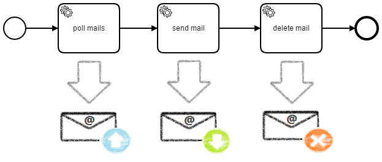

# camunda-bpm-mail

A community extension for Camunda BPM to integrate emails in a process and interact with them.



## Features

* send mail
* poll mails
* delete mails
* react on incoming mails

## Install

> Requirements:
* Camunda BPM >= 7.5.0
* Java 8

### For Embedded Process Engine

Add `camunda-bpm-mail-core` as dependency to your application. Using Maven, you have to add the following lines to your POM:

```xml
<dependency>
  <groupId>org.camunda.bpm.extension</groupId>
  <artifactId>camunda-bpm-mail-core</artifactId>
  <version>1.2.0</version>
</dependency>
```

### For Shared Process Engine

Add `camunda-bpm-mail-core-1.2.0.jar` to your application server (e.g. `apache-tomcat-8.0.24\lib`).

Also make sure that you included the following dependencies:

* [camunda-connect-core](http://mvnrepository.com/artifact/org.camunda.connect/camunda-connect-core/1.0.3) >= 1.0.3
* [JavaMail](http://mvnrepository.com/artifact/com.sun.mail/javax.mail/1.5.5) >= 1.5.5
* [slf4j-api](http://mvnrepository.com/artifact/org.slf4j/slf4j-api/1.7.21) >= 1.7.21

If you use Wildfly, follow the [special instructions](docs/shared-process-engine-wildfly.md).

## How to use it?

The extension is build on top of the [Connectors API](http://docs.camunda.org/manual/latest/reference/connect/) and provide some connectors for interacting with emails. The connectors can be used inside a process as implementation of a service task and are referenced by id. Use the Camunda Modeler to configure it.

```xml
<serviceTask id="sendMail" name="Send Mail Task">
  <extensionElements>
    <camunda:connector>
      <camunda:connectorId>mail-send</camunda:connectorId>
      <!-- input / output mapping -->
    </camunda:connector>
  </extensionElements>
</serviceTask>
```

See the [connectors user guide](http://docs.camunda.org/manual/latest/user-guide/process-engine/connectors/) how to configure the process engine to use connectors.

### Send Mails


Connector-Id: mail-send

Input parameter | Type | Required?
----------------|------|----------
from | String |no (read from config)
fromAlias | String | no (read from config)
to | String | yes
cc | String | no
bcc | String | no
subject | String | yes
text | String | no
html | String | no
fileNames | List of String (path to files) | yes

The text or html body can also generated from a template (e.g. using FreeMarkeer). See the [example](examples/pizza#send-a-mail).

### Poll Mails


Connector-Id: mail-poll

Input parameter | Type | Required?
----------------|------|----------
folder | String (e.g. 'INBOX') | no (read from config)
download-attachements | Boolean | no (read from config)

Output parameter | Type
-----------------|----------
mails | List of [Mail](extension/core/src/main/java/org/camunda/bpm/extension/mail/dto/Mail.java)

If `download-attachements` is set to `true` then it stores the attachments of the mails in the folder which is provided by the configuration. The path of the stored attachments can be get from the [Attachment](extension/core/src/main/java/org/camunda/bpm/extension/mail/dto/Attachment.java)s of the [Mail](extension/core/src/main/java/org/camunda/bpm/extension/mail/dto/Mail.java).

By default, the polled mails are marked as read. If the property `mail.imaps.peek` is set to `true` then the mails are just polled and not marked as read. 

### Delete Mails


Connector-Id: mail-delete

Input parameter | Type | Required?
----------------|------|----------
folder | String (e.g. 'INBOX') | no (read from config)
mails  | List of Mail | no<sup>1</sup>
messageIds | List of String | no<sup>1</sup>
messageNumbers | List of Integer | no<sup>1</sup>

<sup>1</sup> Either `mails`, `messageIds` or `messageNumbers` have to be set.

### React on incoming Mails


The extension provide the [MailNotificationService](extension/core/src/main/java/org/camunda/bpm/extension/mail/notification/MailNotificationService.java) to react on incoming mails (e.g. start a process instance or correlate a message). You can register handlers / consumers which are invoked when a new mail is received.

```java
MailNotificationService notificationService = new MailNotificationService(configuration);

notificationService.registerMailHandler(mail -> {
  runtimeService.startProcessInstanceByKey("process",
    Variables.createVariables().putValue("mail", mail));
});

notificationService.start();

// ...

notificationService.stop();
```

If you use a mail handler and enabled `downloadAttachments` in the configuration then it stores the attachments of the mail before invoking the handler. Otherwise, you can also trigger the download manual by calling [Mail.downloadAttachments()](extension/core/src/main/java/org/camunda/bpm/extension/mail/dto/Mail.java#L170).

## How to configure it?

By default, the extension loads the configuration from a properties file `mail-config.properties` on classpath. You can change the lookup path using the environment variable `MAIL_CONFIG`. If you want to lookup a file on the classpath, use the `classpath:` prefix (e.g. `classpath:/my-application.config`).

An example configuration can look like:

```
# send mails via SMTP
mail.transport.protocol=smtp

mail.smtp.host=smtp.gmail.com
mail.smtp.port=465
mail.smtp.auth=true
mail.smtp.ssl.enable=true
mail.smtp.socketFactory.port=465
mail.smtp.socketFactory.class=javax.net.ssl.SSLSocketFactory

# poll mails via IMAPS
mail.store.protocol=imaps

mail.imaps.host=imap.gmail.com
mail.imaps.port=993
mail.imaps.timeout=10000

# if peek = false then the polled mails are marked as read
mail.imaps.peek=false

# additional config
mail.poll.folder=INBOX
mail.sender=USER@google.com
mail.sender.alias=User Inc

mail.attachment.download=true
mail.attachment.path=attachments

# credentials
mail.user=USER@gmail.com
mail.password=PASSWORD
```

You can find some sample configurations at [extension/core/configs](extension/core/configs). If you use a mail provider which has no configuration yet, feel free to add one. You can verify your configuration with the [integration tests](extension/core/src/test/java/org/camunda/bpm/extension/mail/integration/MailProviderIntegrationTest.java).

## Examples

The following examples shows how to use the connectors and services.

* [Pizza Order](examples/pizza)
  * poll mails
  * send mail with generated text body
  * delete mail
* [Print Service](examples/print-service)
  * using the MailNotificationService
  * send mail with attachment

## Next Steps

Depends on the input of the community. Some ideas:

* provide element templates for camunda modeler (not supported yet)
* integration of file process variables
* spring-based configuration

## Contribution

Found a bug? Please report it using [Github Issues](https://github.com/camunda/camunda-bpm-mail/issues).

Want to extend, improve or fix a bug in the extension? [Pull Requests](https://github.com/camunda/camunda-bpm-mail/pulls) are very welcome.

Want to discuss something? The [Camunda Forum](https://forum.camunda.org/c/community-extensions) might be the best place for it.

## FAQ

See also 

* [JavaMail Project Documentation/FAQ](https://java.net/projects/javamail/pages/Home)
* [Oracle JavaMail FAQ](http://www.oracle.com/technetwork/java/faq-135477.html) 

### Can't send / receive mails from Gmail

It can be that Google blocks the requests because it estimates your application as unsafe. You may also received an email from Google. To fix this go to https://www.google.com/settings/security/lesssecureapps and enable less secure apps.

### Notification service throws exceptions (IDLE-Mode)

Make sure that you don't have an older version (< 1.5.5) of `javamail` in your project. By default, the camunda process engine / distribution includes an old version (1.4.1) of `javamail` (i.e. transitively from `commons-email`).

## License

[Apache License, Version 2.0](./LICENSE)
